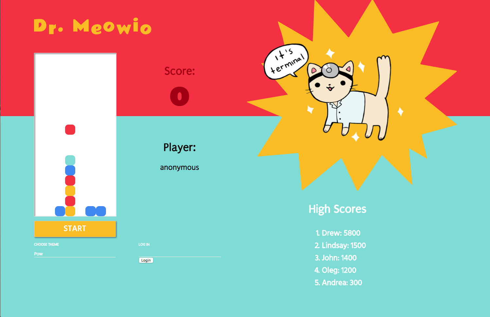

# Dr. Meowio

##### An Addicting Game Built in React and Ruby on Rails in the style of Bejewled/Dr. Mario

* Dr. Meowio Front End Repo - https://github.com/johneckert/dr-meowio-frontend
* Dr. Meowio Back End Repo - https://github.com/johneckert/dr-meowio-backend

# Demo

[Watch Demo on Youtube](https://www.youtube.com/watch?v=Dc_FGiS7ZEU&t)

# How To Play

* You may play anonymously or log-in to track your high score.
* Choose a background theme from the drop-down menu and hit start to begin.
* Use arrow keys to move tile left, right or down.
* Get three tile of the same color in a row to earn points.
* If the tiles reach the top you lose!

### Prerequsites

Ruby v5.1.5
PostgreSQL 10
React

### Back End Setup

1.  Clone this repo - https://github.com/johneckert/dr-meowrio-backend
2.  Install Gems `bundle install`
3.  Setup Database `rake db:create`, then `run rake db:migrate`
4.  Start your server `rails s`

### Front End Setup

1.  Clone this repo - https://github.com/johneckert/dr-meowio-frontend
2.  Install Dependencies `npm install`
3.  Start your server `npm start`

### In Your Browser

Navigate to the web address of your Node server http://localhost:3001 (or whatever yours is) and start a new game

### Additional Info

* For clone to work locally, you will need to create themes in database that correspond to css classes.
* If you like the cat images they are from a web comic called [Doctor Cat](http://doctorcatmd.com/).
